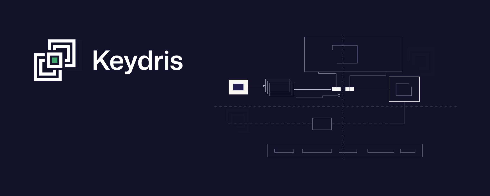

# Run MCP servers without storing upstream API credentials

**Node.js and Python middleware for MCP servers. Redeem single-use KIT action tokens for credentials after Keydris policy checks.**

[](https://www.apache.org/licenses/LICENSE-2.0)
[](https://github.com/keydrisLabs/keydris-reader/actions/workflows/ci.yml)
[](https://www.npmjs.com/package/@keydris/kit-reader)
[](https://pypi.org/project/keydris-kit-reader/)


[](https://discord.gg/mHN8z7qYRV)

---

<p align="center">
  
</p>

<p align="center">
  Request an upstream credential only when an authorized MCP tool call needs it.
</p>

<p align="center">
  <a href="https://keydris.com/">Website</a> ·
  <a href="https://discord.gg/mHN8z7qYRV">Discord</a>
</p>

---

## Why use KIT Reader?

KIT Reader lets your MCP server request the credentials needed for an authorized tool call. It redeems a single-use KIT action token at the Keydris gateway, where policy is checked before credentials are released. Available for Node.js/TypeScript and Python.

The server avoids storing its upstream API credential in its environment, image, or boot-time configuration. The gateway evaluates the tool name, arguments, and downstream target before releasing a credential. That protects the credential-release boundary; it does **not** constrain how the receiving MCP server uses a released credential afterwards. Keep the credential in call-local state, do not log it, and route server egress through an enforcement point if that downstream use must also be governed.

- **Per-action credential release.** The gateway checks policy before it returns a credential for a tokenized action.
- **Action binding.** The tool name and exact arguments travel with the action token; the redemption also includes the outbound target.
- **No stored upstream credential.** The sample and recommended integration obtain the upstream credential at call time rather than keeping it in server configuration.
- Failures are answers, not crashes. A missing token, a policy denial, an unreachable gateway: each comes back as a readable tool error rather than an HTTP failure the agent has to guess at.
- Zero runtime dependencies, in both languages. Framework adapters are optional; the core is plain standard library.

---

## The flow

```
agent ──► proxy ──► POST /v1/runtime/mcp/kit-action-tokens ──► KIT action token
          proxy ──► POST /mcp
                    params._meta["keydris/kit_action_token"] = token
                                                            ──► the MCP server
                    the MCP server ──► POST /gateway/credentials
                                      {token, mcp:{method, action_name, parameters},
                                              target:{host, path, method}}
                                   ◄── {credentials:[{type,name,prefix,value}]}
                    the MCP server ──► the upstream API  (credential applied)
```

These three values have different owners and lifetimes:

| Value | Held by | Purpose |
| --- | --- | --- |
| **Session KIT** | The Keydris-enabled agent session and local proxy | A short-lived session identity used to ask the control plane to mint action tokens. It is not an upstream API credential and is not sent to the MCP server as a credential. |
| **KIT action token** | The proxy, then the MCP request's `_meta` | A single-use, action-bound token minted from the session KIT for one governed MCP action. Reader redeems this token at the gateway. |
| **Upstream credential** | The receiving MCP server during its tool call | The value released by the gateway after its policy checks. Reader applies it to the upstream request; the server must keep it call-local and must not log or cache it. |

The policy decision is about whether to release the upstream credential for the requested action. Once released, the receiving server handles that credential during the call. Reader does not itself enforce what the server subsequently does with it.

Inside the server, the library owns exactly three moments.

| Stage | Node | Python | What it does |
| --- | --- | --- | --- |
| **Find** | [`token.ts`](node/packages/kit-reader/src/token.ts) | [`token.py`](python/packages/kit-reader/src/keydris_kit_reader/token.py) | Pull the token and the authorized call out of the JSON-RPC body |
| **Redeem** | [`redeem.ts`](node/packages/kit-reader/src/redeem.ts) | [`redeem.py`](python/packages/kit-reader/src/keydris_kit_reader/redeem.py) | POST it to the gateway, interpret the answer |
| **Spend** | [`credentials.ts`](node/packages/kit-reader/src/credentials.ts) | [`credentials.py`](python/packages/kit-reader/src/keydris_kit_reader/credentials.py) | Apply the released envelope to the outbound request |

---

## Implementations

| Language | Library | Sample server | Status |
| --- | --- | --- | --- |
| Node / TypeScript | [`@keydris/kit-reader`](node/packages/kit-reader) | [`github-mcp-server`](node/examples/github-mcp-server) | Available |
| Python | [`keydris-kit-reader`](python/packages/kit-reader) | [`github-mcp-server`](python/examples/github-mcp-server) | Available |

The two are the same library twice, not a port and a wrapper: the `_meta` key, the redemption body, and the failure messages are identical, so the proxy, the gateway, and the agent cannot tell which one is answering. A test (`test_parity.py`) reads the Node sources and asserts every Python failure string appears in them verbatim.

The split between **library** and **sample** is deliberate. The library is what you install: dependency-free and framework-agnostic. The sample is what you read, run, and copy; it is never published.

---

## The wire contract

### What arrives

```json
{
  "jsonrpc": "2.0",
  "id": 1,
  "method": "tools/call",
  "params": {
    "name": "github_whoami",
    "arguments": { "verbose": true },
    "_meta": { "keydris/kit_action_token": "<token>" }
  }
}
```

### What goes out

```json
{
  "token": "<token>",
  "mcp": {
    "method": "tools/call",
    "action_name": "github_whoami",
    "parameters": { "verbose": true }
  },
  "target": { "host": "api.github.com", "path": "/user", "method": "GET" }
}
```

The `target` names the downstream request the credential is for — hostname without port, path
without query — and the gateway requires it for every KIT redemption: it is what vault host/path
patterns and credential policy are evaluated against. A legacy header token is sent alone, with
neither `mcp` nor `target`.

### What comes back

```json
{
  "credentials": [
    { "type": "header", "name": "Authorization", "prefix": "Bearer ", "value": "ghp_..." }
  ]
}
```

A refusal is a non-2xx carrying a code: `policy_denied`, `credential_not_found`, `session_inactive`, or `credential_unavailable`.

---

## Getting Started

### Prerequisites

- Node 20+ (npm), or Python 3.10+ ([uv](https://docs.astral.sh/uv/))
- The Keydris gateway endpoint, `https://api.keydris.com/gateway/credentials`; or a stub (see [Trying it without a control plane](#trying-it-without-a-control-plane))

### Complete Keydris walkthrough

This walkthrough uses the Node sample. The Python sample follows the same control-plane flow and listens on port `8788` instead of `8787`.

1. In the Keydris console, create or select the agent that will call this MCP server. Copy that agent's UUID from **Agents**; this is the agent ID passed to the CLI. The policy will be assigned to this agent in step 5. The CLI does not choose a policy.
2. Configure and start the sample. `KEYDRIS_GATEWAY_URL` is the credential-redemption endpoint, `https://api.keydris.com/gateway/credentials`; it is not the agent ID, the session KIT, or a GitHub token.

   ```bash
   cd node
   npm install
   Copy-Item examples/github-mcp-server/.env.example examples/github-mcp-server/.env
   npm run dev
   ```

   On macOS/Linux, use `cp` instead of `Copy-Item`. Edit the sample `.env` only if your GitHub API base differs from its documented default.
3. In **Integrations**, register the running sample's actual MCP URL (for local Node, `http://localhost:8787/mcp`; use your deployed HTTPS URL in production), select **Kit Reader** enforcement, and select the `github_whoami` tool discovered from the server. The registered URL is the connection identity used when the gateway evaluates credential release.
4. In **Credentials/Vault**, add the GitHub PAT and configure its routing for that registered MCP host and path (local Node: host `localhost`, path `/mcp`). Set its injection to `Authorization` with `Bearer {value}`. Configure one unambiguous matching vault entry.
5. In the policy builder, add an integration rule that allows this agent to call the selected `github_whoami` tool. Add a separate credential rule that allows release of the routed GitHub PAT to the registered MCP connection. Save the policy, then assign that policy to the agent from step 1. An allowed tool rule alone is not sufficient to release the credential.
6. Configure the local Keydris client with the agent ID and start a governed agent session. `keydris init` signs in if necessary, discovers the agent policy's governed destinations, and configures the local proxy; no proxy scope is entered manually.

   ```bash
   keydris init codex <agent-id-from-Agents>
   keydris status
   keydris codex
   ```

   Use `keydris init claude-code <agent-id-from-Agents>` and `keydris run -- claude` for Claude Code. The angle-bracket text above describes exactly where the value comes from; replace it with the UUID copied in step 1.
7. From the governed agent session, invoke `github_whoami` on the registered sample server. The proxy uses its session KIT to mint a KIT action token, injects that token into the MCP call, and Reader redeems it. With both policy rules allowing the call, the sample returns the GitHub identity.
8. Change the integration rule or the credential rule to reject the same call, save it, and invoke `github_whoami` again. The tool should return a readable gateway refusal such as `policy_denied`; it must not receive an upstream credential. In the Keydris console, open **Decisions** (or **Audit**) and filter by the agent and MCP connection to inspect the allowed and denied decision records. A credential-rule denial demonstrates that tool authorization and credential release are separate checks.

For production, register the deployed HTTPS URL before assigning policy and keep the vault routing host/path aligned with that registered URL. Keep `KEYDRIS_GATEWAY_URL` set to `https://api.keydris.com/gateway/credentials`.

### Installation

```bash
git clone https://github.com/keydrisLabs/keydris-reader.git
cd keydris-reader
```

### Run the sample server

```bash
cd node                                                       # or: cd python
npm install                                                   # uv sync --all-packages
cp examples/github-mcp-server/.env.example examples/github-mcp-server/.env
npm run dev                                                   # uv run github-mcp-server
```

The Node sample listens on `:8787` and the Python one on `:8788`, different ports so both can run at once, and each redeems against the gateway URL in that `.env`.

### Install the library in your own server

```bash
npm install @keydris/kit-reader
```

```bash
pip install keydris-kit-reader          # or: uv add keydris-kit-reader
pip install 'keydris-kit-reader[mcp]'   # if you serve with the MCP Python SDK
```

---

## Use it in your own server

Four steps. The full version is in the library README for your language: [Node](node/packages/kit-reader/README.md), [Python](python/packages/kit-reader/README.md).

### 1. Construct one reader at startup

It holds no per-request state, only where to redeem, so one instance serves every connection.

```ts
import { createKitReader } from '@keydris/kit-reader';

const reader = createKitReader({ gatewayUrl: process.env.KEYDRIS_GATEWAY_URL! });
```

```python
from keydris_kit_reader import KitReader

reader = KitReader(gateway_url=os.environ["KEYDRIS_GATEWAY_URL"])
```

### 2. Arm a one-shot spend per request

The gateway redeems a KIT action token only together with the downstream `target` (host, path,
method) of the request it authorizes — which is known inside the tool at fetch time, not when the
MCP request arrives. So the adapter does not redeem: it arms a spend the tool calls once.

```ts
import { keydrisCredentials, kitSpendFrom } from '@keydris/kit-reader/express';

app.post('/mcp', express.json(), keydrisCredentials(reader), async (req, res) => {
  const server = createYourMcpServer(kitSpendFrom(req)); // build per request
  // ...connect a transport and handle the request
});
```

```python
from keydris_kit_reader.mcp import current_spend, keydris_credentials

mcp = MCPServer("your-server", middleware=[keydris_credentials(reader)])
```

### 3. Spend it once, at fetch time

In Node, `keydrisFetch` does the whole exchange — derives the target from the URL, redeems,
applies the released credentials, and sends:

```ts
import { keydrisFetch } from '@keydris/kit-reader';

const result = await keydrisFetch(spend, 'https://api.github.com/user', { headers });
if (!result.ok) {
  return { content: [{ type: 'text', text: result.problem }], isError: true };
}
// result.response is the upstream Response
```

In Python, call the spend with the target, then apply:

```python
redemption = await current_spend()({"host": "api.github.com", "path": "/user", "method": "GET"})
if not redemption.ok:
    raise ToolError(redemption.problem)
url = apply_credentials(redemption.credentials, url, headers)   # headers in place, URL returned
```

A refusal is a readable `problem` for the agent — report it as a tool error, do not throw.

The applied value is always `prefix + value`, so the vault can express formats like `Bearer {value}` or `v1_{value}` without your server hard-coding them.

---

## Every outcome, and whether the gateway is contacted

| # | Situation | Gateway called | Result |
| --- | --- | --- | --- |
| 1 | Body calls no tool (`initialize`, `tools/list`) | No | `undefined` / `None` |
| 2 | `_meta` token is a non-string or empty | No | The KIT action token is malformed |
| 3 | Two tokenized `tools/call`s in one body | No | One token authorizes one action |
| 4 | Tokenized call with empty `name`, or non-object `arguments` | No | The tokenized tool call is malformed |
| 5 | `_meta` token differs from the header token | No | Conflicting tokens, refused rather than resolved |
| 6 | No token anywhere | No | Nothing to exchange for a credential |
| 7 | KIT action token with no downstream `target` | No | The redemption needs the target (host, path, method) |
| 8 | Gateway unreachable, transport raised | Attempted | The gateway could not be reached |
| 9 | Gateway refused with a code | Yes | The gateway refused: `{code}` |
| 10 | Gateway refused with no readable code | Yes | The gateway refused: HTTP `{status}` |
| 11 | 2xx with no credentials | Yes | The gateway released nothing |
| 12 | Credentials released | Yes | `{ok: true, credentials}` / `Released(...)` |

Rows 2 through 7 are the reason the library is worth having: six distinct ways a request can be un-redeemable, each answered before a network call, each with a sentence the agent can act on. Those exact strings are part of the wire contract.

---

## What it guarantees, and what is yours to get right

### Guaranteed

- **Only `tools/call` costs a secret.** Discovery never touches the gateway; a client with no token can connect and list tools.
- **One token authorizes one action.** A batch that reuses a token is refused locally.
- **Redemption never raises.** Every failure is a `problem` string written for an agent to read.
- **No state between requests.** The reader stores configuration only.
- **(Python) A released secret does not print.** `Released.__repr__` is redacted, so an envelope in a traceback does not take the credential with it.

### Yours

- **Serve stateless, build per request.** A long-lived MCP session outlives the short-lived token that authorized it. Keep the released credential on the stack of the call it was released for, and never cache a `Redemption`.
- **Never log `credentials`.** The `problem` side is safe to log freely; it carries no secret.

See [SECURITY.md](SECURITY.md) for the full model, including what is deliberately out of scope.

---

## Project Structure

```
keydris-reader/
├── node/
│   ├── packages/kit-reader/          @keydris/kit-reader (the published library)
│   │   └── src/
│   │       ├── index.ts              public surface (re-exports only)
│   │       ├── types.ts              wire shapes + the Redemption union
│   │       ├── token.ts              _meta extraction, Bearer stripping, batch rules
│   │       ├── redeem.ts             createKitReader(): decision tree + gateway POST
│   │       ├── credentials.ts        applyCredentials(): header / query injection
│   │       ├── fetch.ts              keydrisFetch(): derive target, spend, apply, send
│   │       └── express.ts            optional /express subpath adapter (arms req.kitSpend)
│   ├── examples/github-mcp-server/   the sample server (private, not published)
│   ├── Dockerfile, fly.toml          deployment; context spans both workspaces
│   └── package.json                  npm workspaces root
├── python/
│   ├── packages/kit-reader/          keydris-kit-reader (the published library)
│   │   ├── src/keydris_kit_reader/
│   │   │   ├── types.py              TypedDicts + Released / Refused dataclasses
│   │   │   ├── token.py              the twin of token.ts
│   │   │   ├── redeem.py             KitReader: the twin of redeem.ts
│   │   │   ├── credentials.py        apply_credentials()
│   │   │   ├── transport.py          the pluggable HTTP seam (Python only)
│   │   │   └── mcp.py                optional MCP Python SDK middleware
│   │   └── tests/                    ported Node suite + transport + parity tests
│   ├── examples/github-mcp-server/   the sample server (not published)
│   └── pyproject.toml                uv workspace root
├── images/                           branding assets
└── .github/workflows/                ci.yml, release.yml, release-python.yml
```

---

## Configuration

### Library options

| Node | Python | Default | Meaning |
| --- | --- | --- | --- |
| `gatewayUrl` | `gateway_url` | *required* | The control plane's redemption endpoint. Python requires `http(s)`. |
| `tokenHeader` | `token_header` | `authorization` | Legacy header accepted as a fallback. Trimmed and lowercased. |
| `fetch` | `transport` | global `fetch` / `urllib` | Injectable, for tests or an instrumented client. |
| n/a | `timeout` | `10.0` | Seconds the default Python transport waits. |

### Sample-server environment

| Variable | Node default | Python default | Notes |
| --- | --- | --- | --- |
| `HOST` | n/a | `127.0.0.1` | Loopback by default. |
| `PORT` | `8787` | `8788` | Must match what the proxy dials; the gateway looks the credential up by that host. |
| `KEYDRIS_GATEWAY_URL` | `https://api.keydris.com/gateway/credentials` | same | Keydris credential-redemption endpoint. |
| `KEYDRIS_TOKEN_HEADER` | `authorization` | same | Must match the control plane's `ACCESS_TOKEN_INJECT_HEADER`. |
| `GITHUB_API_BASE` | `https://api.github.com` | same | Point at a stub to exercise the flow offline. |
| `KEYDRIS_ALLOWED_HOSTS` | n/a | unset | Python only, comma-separated. Without it the SDK answers 421 on non-localhost hosts. |

---

## Trying it without a control plane

Point `KEYDRIS_GATEWAY_URL` at any stub that answers a `credentials` array, and `GITHUB_API_BASE` at a stub `/user`. The server does not verify the token itself (that is the gateway's job), so any string works as the bearer:

```bash
curl -X POST http://localhost:8787/mcp \
  -H 'content-type: application/json' \
  -H 'accept: application/json, text/event-stream' \
  -d '{"jsonrpc":"2.0","id":1,"method":"tools/call","params":{
        "name":"github_whoami","arguments":{},
        "_meta":{"keydris/kit_action_token":"anything"}}}'
```

Remove the `_meta` block and the same call returns the redemption failure instead, which is the whole demonstration. The sample READMEs have the long version: [Node](node/examples/github-mcp-server/README.md#trying-it-without-a-control-plane), [Python](python/examples/github-mcp-server/README.md#trying-it-without-a-control-plane).

---

## Node and Python differences

The wire behavior is identical. The differences are idiom and platform.

| Concern | Node | Python |
| --- | --- | --- |
| Construction | `createKitReader(options)` factory | `KitReader(...)` class, keyword-only |
| HTTP | global `fetch`, injectable | `Transport` protocol; stdlib `urllib` default, run off-loop |
| Timeout | none (fetch default) | `timeout=10.0`, mandatory in the default transport |
| Gateway URL validation | none needed | explicit `http(s)` check at construction |
| Result type | discriminated union on `ok` | `Released` / `Refused` dataclasses with `Literal["ok"]` |
| Secret in reprs | not addressed | `Released.__repr__` redacted |
| Applying a credential | mutates `URL` and `Headers` | mutates headers, returns the new URL |
| Adapter | Express middleware, `req.kitSpend` via `kitSpendFrom(req)` | MCP-SDK middleware, `current_spend()` |
| Scope teardown | integrator's job (per-request server) | ContextVar reset in `finally` |

---

## Tests and CI

| Suite | Covers |
| --- | --- |
| `token.test.ts` / `test_token.py` | Extraction rules, Bearer stripping, batch refusal |
| `redeem.test.ts` / `test_redeem.py` | All eleven outcomes, against a recording gateway stub |
| `credentials.test.ts` / `test_credentials.py` | Header and query application, replacement semantics |
| `test_transport.py` | A real `ThreadingHTTPServer` over a socket, plus unreachability |
| `test_parity.py` | Every Python failure string, asserted verbatim against the Node sources |

CI runs two jobs on every pull request: *node* (`npm ci`, typecheck, test, build, `npm pack --dry-run`) and *python* (a 3.10 / 3.13 matrix through `ruff`, strict `mypy`, `pytest`, `uv build`, `twine check`).

Releases are package-scoped tags so the two libraries version independently: `kit-reader-v*` for npm, `kit-reader-py-v*` for PyPI. Both workflows refuse to publish if the tag and the manifest disagree, and both use trusted publishing via GitHub OIDC, so there is no npm token, no PyPI token, and a provenance attestation on every release.

---

## Who Is This For?

- **MCP server authors** who do not want to be the custody point for someone else's API key
- **Platform and security teams** who need per-call authorization instead of a long-lived environment secret
- **Enterprises** that need policy evaluated against the actual tool call, with an audit trail of what was released and why
- **Agent developers** who want refusals to arrive as readable tool errors instead of opaque 500s
- **Anyone deploying MCP to untrusted infrastructure** who wants to avoid placing an upstream API credential in the server's stored configuration

---

## Frequently Asked Questions

### Does my server still need an API key configured somewhere?

The Reader integration does not require the upstream API key to be stored in the MCP server. Configure the gateway URL and normal server settings, then let the gateway release the upstream credential after the relevant policy checks. This does not make a general claim about every other secret your server or deployment may use.

### Do I have to use Express or the MCP Python SDK?

No. The adapters are thin conveniences over one call. Fastify, Hono, Starlette, FastAPI, a Lambda handler, or a raw HTTP server all call `reader.redeem(body, ...)` directly.

### What happens to `initialize` and `tools/list`?

They pass straight through and never touch the gateway. A client with no token can connect and see what is on offer; it discovers it needs a token only when it asks for something that reveals a credential.

### Can a Node server and a Python server sit behind the same policy?

Yes. The `_meta` key, the redemption body, and the failure strings are identical in both, and a parity test enforces it, so the proxy and the gateway cannot tell which one is answering.

### What does the agent see when policy denies the call?

A tool error whose text names the reason, for example *The Keydris gateway refused: policy_denied.* Redemption never raises, so the agent gets a sentence it can act on rather than an HTTP failure.

### Does this govern what my server does after it gets the credential?

No. Reader governs credential release to the receiving MCP server, not the server's subsequent use of that credential. The receiving server handles it during the call. Govern that downstream use separately, for example by routing the server's egress through Keydris.

### Can I use it commercially?

Yes. Apache License 2.0 covers commercial and private use, with a patent grant. See [LICENSE](LICENSE) and [NOTICE](NOTICE).

---

## Security

Do not open a public issue for a vulnerability, and do not report one on Discord. [SECURITY.md](SECURITY.md) covers private reporting, the supported versions, the threat model the libraries do and do not defend against, and a hardening checklist for deployers.

---

## Community

| Where | For what |
| --- | --- |
| [keydris.com](https://keydris.com/) | The proxy, gateway, and vault this library redeems against |
| [Discord](https://discord.gg/mHN8z7qYRV) | Questions, integration help, and what to build next |
| [Issues](https://github.com/keydrisLabs/keydris-reader/issues) | Bugs and feature requests, in public |
| [Security](SECURITY.md) | Vulnerabilities, privately |

---

## Contributing

Contributions are welcome. [CONTRIBUTING.md](CONTRIBUTING.md) has the development setup for both workspaces, the checks CI will run, and the one rule specific to this repository: the failure strings are part of the wire contract, so a change to either language has to be mirrored in the other and pinned by the parity test.

1. Fork the repository
2. Create a branch (`git checkout -b feat/your-change`)
3. Make the change in both languages if it touches behavior
4. Run the checks for the workspaces you touched
5. Open a pull request

By participating you agree to the [Code of Conduct](CODE_OF_CONDUCT.md).

---

## License

Licensed under the **Apache License 2.0**: free for personal, commercial, and private use, with an explicit patent grant and a requirement to preserve notices.

See [LICENSE](LICENSE) for the full text and [NOTICE](NOTICE) for attribution.

---

## Acknowledgements

Built on:

- [Model Context Protocol](https://modelcontextprotocol.io/) and its [TypeScript](https://github.com/modelcontextprotocol/typescript-sdk) and [Python](https://github.com/modelcontextprotocol/python-sdk) SDKs
- [Keydris](https://keydris.com/), the proxy, gateway, and vault the tokens are redeemed against

---

**If keydris-reader took a secret out of one of your servers, a star helps others find it.**
